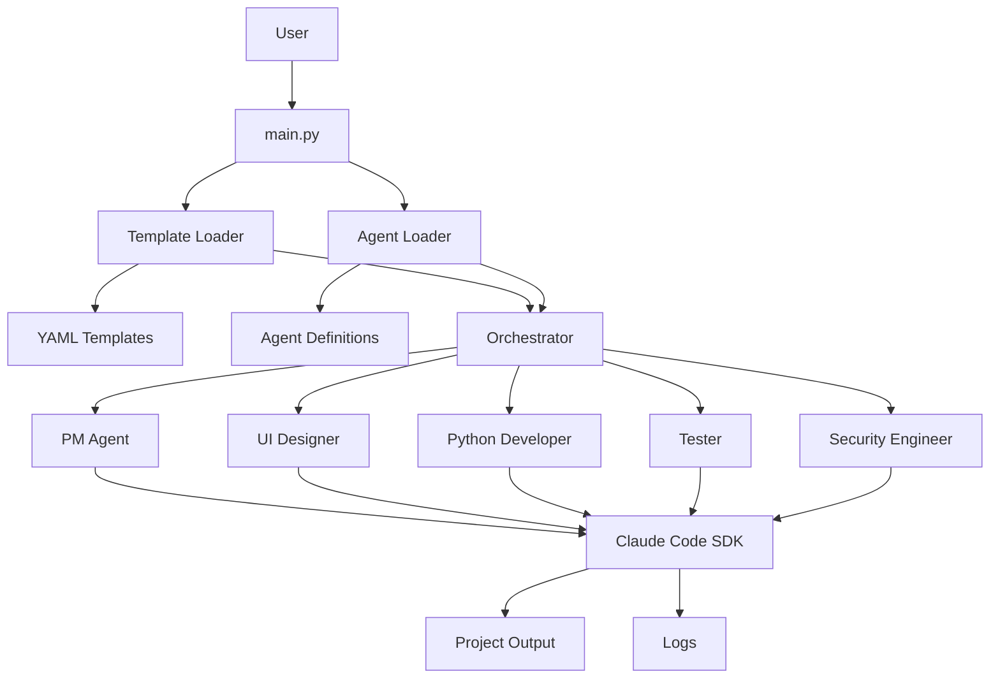

# 🤖 Multi-Agent Development System

Claude Code SDKを使用した**汎用的なマルチエージェントシステム**です。YAMLテンプレートを使用して、様々なソフトウェア開発プロジェクトを自動化できます。

## 🎯 概要

5つの専門エージェント（PM、UIデザイナー、Python開発者、テスター、セキュリティエンジニア）が連携して、**テンプレート定義されたプロジェクト**を自動開発します。プロジェクトタイプに応じたYAMLテンプレートを作成することで、様々な技術スタックに対応可能です。

## 🏗️ システムアーキテクチャ



### 主要コンポーネント

- **Orchestrator**: エージェント間の実行順序を管理
- **Template System**: プロジェクト定義をYAMLで管理
- **Agent System**: 専門分野別のエージェント定義
- **Claude Code SDK Integration**: 各エージェントがClaude Code SDKを実行
- **Auto-Retry System**: エラー発生時の自動リトライ機能
- **Output Management**: プロジェクトファイルとログの生成

## 🏗️ プロジェクト構造

```
multi-ai-agent/
├── main.py                    # メイン実行ファイル
├── config.py                  # 設定とプロンプトテンプレート
├── requirements.txt           # Python依存関係
├── README.md                  # このファイル
├── agents/                    # エージェント定義
│   ├── pm.yaml
│   ├── python_developer.yaml
│   ├── security_engineer.yaml
│   ├── tester.yaml
│   └── ui_designer.yaml
├── models/                    # データモデル
│   ├── __init__.py
│   ├── task.py               # AgentTask, AgentResult
│   └── log.py                # ログ関連モデル
├── core/                     # コアロジック
│   ├── __init__.py
│   ├── agent.py              # ClaudeCodeAgent
│   ├── agent_loader.py       # AgentLoader
│   ├── conversation_replayer.py # ConversationReplayer
│   ├── log_manager.py        # LogManager
│   ├── orchestrator.py       # MultiAgentOrchestrator
│   └── template_loader.py    # TemplateLoader
├── templates/                # プロジェクトテンプレート
│   └── simple_todo.yaml      # ToDoアプリテンプレート
├── venv/                     # Python仮想環境
└── output/                   # 生成されるプロジェクト
    └── logs/                 # 実行ログ
```

## 🚀 クイックスタート

### 1. 環境準備

```bash
# Python仮想環境セットアップ（推奨）
python3 -m venv venv
source venv/bin/activate  # Linux/Mac
# venv\Scripts\activate  # Windows

# Python依存関係インストール
pip install -r requirements.txt

# Claude Code SDK インストール
pip install claude-code

# または、Claude Proユーザーの場合は認証のみ
claude auth login
```

### 2. 基本実行

```bash
# 対話式テンプレート選択
python main.py

# 特定テンプレートで実行
python main.py --template simple_todo

# 利用可能なテンプレート一覧
python main.py --list-templates

# 利用可能なエージェント定義一覧
python main.py --list-agents

# テンプレート検証
python main.py --validate-template simple_todo

# エージェント定義検証
python main.py --validate-agents
```

### 3. 高度な使用方法

```bash
# カスタムプロジェクトディレクトリ
python main.py --template simple_todo --project-dir ./my_todo_app

# カスタムテンプレート・エージェントディレクトリ
python main.py --templates-dir ./custom_templates --agents-dir ./custom_agents

# 環境チェックのみ（テンプレートとエージェント定義も検証）
python main.py --dry-run

# 詳細ログ有効
python main.py --template simple_todo --verbose

# タイムアウト設定（デフォルト: 30分）
python main.py --template simple_todo --timeout 300   # 5分に短縮
python main.py --template simple_todo --timeout 3600  # 60分に延長

# リトライ設定（デフォルト: 5回ブロックリトライ）
python main.py --template simple_todo --max-retries 3  # 最大3回リトライ
python main.py --template simple_todo --max-retries 1  # リトライなし
```

## 👥 エージェント定義システム

### 提供されるエージェント定義

| エージェント | 役割 | 専門分野 |
|-------------|------|----------|
| **pm** | Product Manager | 要件定義、プロジェクト管理、ビジネス分析 |
| **ui_designer** | UI/UX Designer | インターフェース設計、API設計、システムアーキテクチャ |
| **python_developer** | Python Developer | バックエンド・フロントエンド開発、クラウド開発 |
| **tester** | QA Engineer | テスト戦略、品質保証、セキュリティテスト |
| **security_engineer** | Security Engineer | セキュリティ監査、脆弱性診断、セキュアコーディング |

### エージェント定義の構造

```yaml
# agents/pm.yaml
role: "pm"
display_name: "Product Manager"
description: "プロダクトマネージャー・ビジネスアナリスト"

expertise:
  - "要件定義・仕様策定"
  - "ステークホルダー管理"
  - "プロジェクト計画・スケジュール管理"

instructions: |
  あなたは経験豊富なプロダクトマネージャーです。
  以下の原則に従って行動してください：
  
  【基本姿勢】
  - ユーザーニーズを最優先に考える
  - データドリブンな意思決定を心がける
  ...

context_keywords:
  - "要件"
  - "仕様"
  - "企画"
  - "戦略"

specializations:
  startup: "スタートアップ企業でのプロダクト立ち上げ経験"
  enterprise: "大企業でのエンタープライズソフトウェア開発経験"

collaboration:
  ui_designer: "要件を具体的なUI/UX要求に落とし込む際の協力"
  python_developer: "技術的実現可能性の確認と調整"
```

### カスタムエージェント定義の作成

```yaml
# agents/mobile_developer.yaml
role: "mobile_developer"
display_name: "Mobile App Developer"
description: "モバイルアプリケーション開発者"

expertise:
  - "React Native開発"
  - "iOS/Android開発"
  - "モバイルUX設計"
  - "アプリストア最適化"

instructions: |
  あなたは経験豊富なモバイルアプリ開発者です。
  
  【モバイルファースト】
  - モバイルプラットフォームの制約を理解する
  - バッテリー効率とパフォーマンスを最優先する
  - タッチインターフェースに最適化する
  
  【クロスプラットフォーム】
  - React Native・Flutterでの効率的な開発
  - プラットフォーム固有機能の活用
  - 統一されたユーザーエクスペリエンス

context_keywords:
  - "モバイル"
  - "アプリ"
  - "iOS"
  - "Android"
  - "React Native"

specializations:
  ios_native: "Swift・Objective-C によるiOS開発"
  android_native: "Kotlin・Java によるAndroid開発"
  cross_platform: "React Native・Flutter開発"

collaboration:
  ui_designer: "モバイルUI・UX設計の協力"
  python_developer: "バックエンドAPI連携"
  tester: "モバイルアプリテスト戦略"
```

### エージェント定義の管理

```bash
# エージェント定義一覧
python main.py --list-agents

# エージェント定義検証
python main.py --validate-agents

# カスタムエージェントディレクトリ使用
python main.py --agents-dir ./my_agents

# テンプレートとエージェントの互換性チェック
python main.py --validate-template simple_todo --agents-dir ./my_agents
```

## 📋 利用可能なテンプレート

### 1. ToDoアプリ (`simple_todo.yaml`)
- **技術スタック**: Python Flask + SQLite3 + Bootstrap 5
- **フェーズ**: 計画 → API/UI設計 → 開発 → テスト → セキュリティ監査
- **成果物**: 完全動作するToDoアプリケーション、REST API、テストスイート

## 🎨 カスタムテンプレートの作成

### テンプレート構造

```yaml
# custom_project.yaml
project:
  name: "Custom Project"
  description: "プロジェクトの説明"
  technology_stack:
    - "技術1"
    - "技術2"

workflow:
  phases:
    - phase: "phase1"
      agent: "pm"
      dependencies: []
      parallel: false

agents:
  pm:
    role: "Product Manager"
    expertise:
      - "専門分野1"
      - "専門分野2"

tasks:
  phase1:
    agent: "pm"
    title: "タスクタイトル"
    prompt: |
      タスクの詳細な指示...
    output_files:
      - "output1.md"
    context_files:
      - "input1.md"
```

### カスタムテンプレートの例

```yaml
# blog_app.yaml - ブログアプリ開発テンプレート
project:
  name: "Blog Application"
  description: "Flask ブログアプリケーション開発"
  technology_stack:
    - "Python Flask"
    - "SQLite3"
    - "Bootstrap 5"

workflow:
  phases:
    - phase: "planning"
      agent: "pm"
      dependencies: []
      parallel: false
    - phase: "api_design"
      agent: "ui_designer" 
      dependencies: ["planning"]
      parallel: false
    - phase: "development"
      agent: "python_developer"
      dependencies: ["api_design"]
      parallel: false

tasks:
  planning:
    agent: "pm"
    title: "ブログアプリ要件定義"
    prompt: |
      ブログアプリケーションの要件定義を行ってください：
      1. 機能要件（記事投稿、編集、削除など）
      2. 非機能要件
      3. ユーザーストーリー
      4. 技術アーキテクチャ
    output_files:
      - "blog_requirements.md"
    context_files: []
```

## 🔧 設定とカスタマイズ

### config.pyでの設定変更

```python
class Config:
    # Claude Code SDK設定
    CLAUDE_TIMEOUT_SECONDS = 1800
    
    # プロンプト制限
    MAX_PROMPT_LENGTH = 100000
    MAX_CONTEXT_FILES = 10

class TemplateConfig:
    # テンプレート・エージェント設定
    DEFAULT_TEMPLATES_DIR = "./templates"
    DEFAULT_AGENTS_DIR = "./agents"
    DEFAULT_TEMPLATE = "simple_blog"
```

### 新しいエージェントロールの追加

```python
# models/task.py
class AgentRole(Enum):
    PM = "pm"
    UI_DESIGNER = "ui_designer"
    PYTHON_DEVELOPER = "python_developer"
    SECURITY_ENGINEER = "security_engineer"
    TESTER = "tester"
    MOBILE_DEVELOPER = "mobile_developer"  # 新しいロール
    SECURITY_ENGINEER = "security_engineer"
```

### エージェント定義の拡張

```yaml
# agents/security_engineer.yaml
role: "security_engineer"
display_name: "Security Engineer"
description: "セキュリティエンジニア・情報セキュリティ専門家"

expertise:
  - "セキュリティ監査・脆弱性診断"
  - "ペネトレーションテスト"
  - "セキュアコーディング"
  - "コンプライアンス（ISO27001、SOC2）"

instructions: |
  あなたは経験豊富なセキュリティエンジニアです。
  
  【セキュリティバイデザイン】
  - 設計段階からセキュリティを組み込む
  - ゼロトラストアーキテクチャの実装
  - 最小権限の原則を適用する
  
  【脅威モデリング】
  - STRIDE・DREAD手法による脅威分析
  - 攻撃者の視点でシステムを評価
  - リスクベースセキュリティの実装

context_keywords:
  - "セキュリティ"
  - "脆弱性"
  - "暗号化"
  - "認証"
  - "監査"
```

### プロジェクト固有のエージェント定義

```yaml
# project_agents/fintech_compliance.yaml
role: "fintech_compliance"
display_name: "FinTech Compliance Officer"
description: "金融技術コンプライアンス専門家"

expertise:
  - "金融規制（PCI DSS、SOX法）"
  - "反マネーロンダリング（AML）"
  - "顧客確認（KYC）"
  - "金融データ保護"

instructions: |
  あなたは金融技術分野のコンプライアンス専門家です。
  
  【規制遵守】
  - PCI DSS Level 1準拠を確保する
  - GDPR・CCPA等のプライバシー法に対応
  - 金融庁・FINRAの規制要件を満たす
  
  【リスク管理】
  - 金融犯罪防止機能の実装
  - 取引監視・異常検知システム
  - 監査証跡・証拠保全機能
```

## 📊 ログとモニタリング

### リアルタイム出力例

```
🚀 [14:32:15] pm started task: pm_planning_1735721535
   🔧 [pm] Executed: Claude Code SDK call with ToDoアプリ要件定義...
✅ [14:32:28] pm completed in 13.2s
   📁 Created: PROJECT_REQUIREMENTS.md

🔄 [14:32:29] pm → ui_designer: dependency
   📤 Shared: PROJECT_REQUIREMENTS.md
```

### ログ分析

```bash
# 実行時間分析
cat output/logs/session_*/agent_execution.jsonl | jq '.execution_time_seconds'

# テンプレート別の成功率
cat output/logs/session_*/system.log | grep "Template loaded"

# エージェント間相互作用
cat output/logs/session_*/agent_interactions.jsonl | jq '.interaction_type'
```

## 🎭 エージェントの役割（汎用）

| エージェント | 汎用的責任範囲 | 適用例 |
|-------------|---------------|--------|
| **PM** | 要件定義、戦略策定、プロジェクト管理 | ビジネス要件、コンセプト設計、統合レビュー |
| **UIデザイナー** | インターフェース設計、API設計 | UI/UX、システム設計、API仕様 |
| **Python開発者** | バックエンド・フロントエンド実装 | サーバー開発、ウェブ開発、スクリプト作成 |
| **テスター** | 品質保証、セキュリティ、検証 | テスト戦略、監査、パフォーマンス検証 |

## 🛠️ トラブルシューティング

### よくある問題

1. **テンプレートが見つからない**
   ```bash
   # テンプレート一覧確認
   python main.py --list-templates
   
   # テンプレートディレクトリ確認
   ls -la templates/
   ```

2. **テンプレート検証エラー**
   ```bash
   # 詳細検証
   python main.py --validate-template your_template
   
   # YAML構文チェック
   python -c "import yaml; yaml.safe_load(open('templates/your_template.yaml'))"
   ```

3. **エージェントロールエラー**
   ```python
   # models/task.py でロール追加
   class AgentRole(Enum):
       NEW_ROLE = "new_role"
   
   # config.py で指示追加
   ROLE_INSTRUCTIONS = {
       "new_role": "ロール指示..."
   }
   ```

## 🚀 拡張とカスタマイズ

### 並列実行の実装

```yaml
# template.yaml で並列フェーズ指定
workflow:
  phases:
    - phase: "backend"
      agent: "python_developer"
      dependencies: ["design"]
      parallel: false
    - phase: "infrastructure"
      agent: "tester"
      dependencies: ["design"]
      parallel: true  # backend と並列実行
```

### 業界特化テンプレート

```yaml
# fintech_api.yaml - フィンテック特化（Flask + PostgreSQL + JWT認証）
# healthcare_system.yaml - ヘルスケア特化（Flask + 医療データ管理）
# iot_platform.yaml - IoT特化（Flask + MQTT + TimeSeries DB）
# ai_service.yaml - AI/ML特化（Flask + TensorFlow + REST API）
```

### プラグインシステム

```python
# plugins/custom_agent.py
class CustomAgent(ClaudeCodeAgent):
    def __init__(self, role, working_dir, log_manager):
        super().__init__(role, working_dir, log_manager)
        # カスタム機能追加
```

## 🎯 **完成したシステムの特徴**

### **✨ 外部ファイルベースの設定**
- **プロジェクトテンプレート**: YAML形式で完全にカスタマイズ可能
- **エージェント定義**: 詳細な役割・専門性・指示をYAMLで管理
- **ハードコード撲滅**: すべての設定が外部ファイルで変更可能

### **🔧 高度な検証システム**
- **テンプレート検証**: 構造・依存関係・エージェント互換性
- **エージェント検証**: 定義の完全性・専門性カバレッジ
- **統合検証**: テンプレートとエージェントの互換性チェック

### **📊 包括的なログ・監視**
- **リアルタイム進捗表示**: フェーズ実行・成果物作成・エラー状況
- **詳細実行ログ**: エージェント別・タイミング・成功率
- **相互作用追跡**: エージェント間のファイル共有・依存関係
- **セッションサマリー**: 統計情報・パフォーマンス分析

### **🚀 拡張性と再利用性**
- **プラグイン的エージェント**: 新しい専門分野を簡単に追加
- **業界特化テンプレート**: フィンテック・ヘルスケア・IoT等
- **マルチプラットフォーム**: 任意の技術スタックに対応
- **チーム共有**: 組織全体でテンプレート・エージェント定義を共有

### **🎨 ユーザビリティ**
- **対話式選択**: テンプレート・オプションの直感的選択
- **包括的ヘルプ**: 詳細なコマンドライン・ドキュメント
- **エラー診断**: 具体的な修正提案・ガイダンス
- **段階的実行**: dry-run・部分実行・検証モード

## 🏆 **システムアーキテクチャの進化**

```
Before (単一ファイル・ハードコード):
main.py (600行) → 保守困難

After (モジュラー・設定外部化):
├── テンプレートシステム (templates/*.yaml)
├── エージェント定義 (agents/*.yaml)  
├── コアシステム (core/*.py)
├── データモデル (models/*.py)
└── 統合オーケストレーター (main.py)
```

## 📈 パフォーマンス最適化

- **テンプレート設計**: 依存関係を最小化し、並列実行を活用
- **プロンプト最適化**: エージェント定義による明確な指示
- **キャッシュ活用**: テンプレート・エージェント定義のメモリキャッシュ
- **エラーハンドリング**: 失敗タスクの詳細診断・自動リトライ推奨

## 🔄 **自動リトライシステム**

### エラー自動修復機能

このシステムには、エージェントがエラーに遭遇した際に自動的に修正を試みる**自動リトライ機能**が実装されています。

#### 主な特徴

- **インテリジェントリトライ**: エラーの内容を次回実行時のプロンプトに含めて修正を促す
- **指数バックオフ**: リトライ間隔が徐々に長くなる（2秒 → 4秒 → 8秒...最大30秒）
- **解決検証**: 各リトライ後に実際にソリューションが動作するかを検証
- **詳細ログ**: 各試行の詳細とエラー追跡

#### 動作例

```
🎯 Starting workflow block: development_testing
🚀 Starting task development for python_developer
❌ Block development_testing failed at phase testing

🔄 Retrying block development_testing (attempt 2/5)
   Failed phase: testing
🚀 Starting task development for python_developer (retry)
🚀 Starting task testing for tester (retry)
✅ Block development_testing completed successfully
```

#### 設定方法

```bash
# デフォルト（5回ブロックリトライ）
python main.py --template simple_todo

# カスタムリトライ回数
python main.py --template simple_todo --max-retries 3

# リトライなし（1回のみ実行）
python main.py --template simple_todo --max-retries 1
```

## 🔮 **今後の発展可能性**

### **Advanced Features**
- **並列実行エンジン**: 独立タスクの完全並列化
- **AI最適化**: プロンプト自動最適化・エージェント推奨
- **クラウド統合**: AWS・GCP・Azureでの自動実行
- **Web UI**: ブラウザベースの視覚的管理インターフェース

### **Enterprise Features**
- **認証・認可**: SSO・RBAC・監査ログ
- **スケーラビリティ**: 大規模チーム・複数プロジェクト管理
- **ガバナンス**: テンプレート・エージェント承認ワークフロー
- **分析・レポート**: プロジェクト成功率・効率性分析

この**汎用マルチエージェントシステム**により、あらゆるソフトウェア開発プロジェクトを自動化・効率化できます！🎉

## 🤝 コントリビューション

1. Fork this repository
2. Create your feature branch (`git checkout -b feature/amazing-template`)
3. Add your template in `templates/` directory
4. Add your agent definition in `agents/` directory  
5. Test your changes with `python main.py --validate-template your_template`
6. Commit your changes (`git commit -m 'Add amazing template'`)
7. Push to the branch (`git push origin feature/amazing-template`)
8. Open a Pull Request

## 📄 ライセンス

MIT License - 詳細は [LICENSE](LICENSE) ファイルを参照

## 🙏 謝辞

- [Anthropic](https://anthropic.com) for Claude Code SDK
- [AWS](https://aws.amazon.com), [Vercel](https://vercel.com), [Google Cloud](https://cloud.google.com) for Cloud Platforms
- Open Source Community for inspiration
